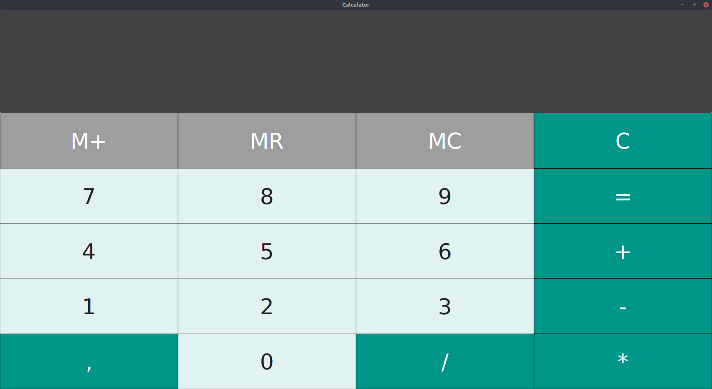

# Calculator

### Development / Local run
Program was written with Java 8. It is a bit deprecated and it is no recommended to run with higher version of Java because JavaFx is no longer part of Java built-it libraries. But if you have Java 8 installed you can run it:
1. Check version of Java and Javac:
    ```
    java -version
    # Correct output eg:
    java version "1.8.0_201"
    Java(TM) SE Runtime Environment (build 1.8.0_201-b09)
    Java HotSpot(TM) 64-Bit Server VM (build 25.201-b09, mixed mode)

    javac -version
    # Correct output eg:
    javac 1.8.0_201
    ```
1. Go into **src** directory:
    ```
    cd src/
    ```
1. Compile sources:
    ```
    javac Main.java
    ```
1. Run program:
    ```
    java Main
    ```
1. Eventually you can use InteliJ to build and run project with `calculator.iml`
### Description
Basic calculator created for programming lessons on studies.</br>
Technologies used in project:
- Java
- JavaFX

The application is fully resizable thanks bindings for example font size and buttons size are always fit to window.</br>
There are used simple ScriptEngine to evaluate expression given by user.</br>
Key's events are also implemented to make application more friendly to user:
- 0...9 key is equivalent Zero...Nine Button
- +, -, /, * key is equivalent Plus, Minus, Divide, Multiply Button
- enter, = key is equivalent Equal Button and it will compute the expression typed by user
- backspace key deletes one char
- Shift + backspace is equivalent C Button and it deletes all textField's content

 Calculator has got a little memory too and there are no equivalent keys to buttons which management this little memory.
 - M+ adds to memory
 - MR puts memory on TextField
 - MC cleans memory

***
Size of appliaction after run a program:


Full screen size application:



